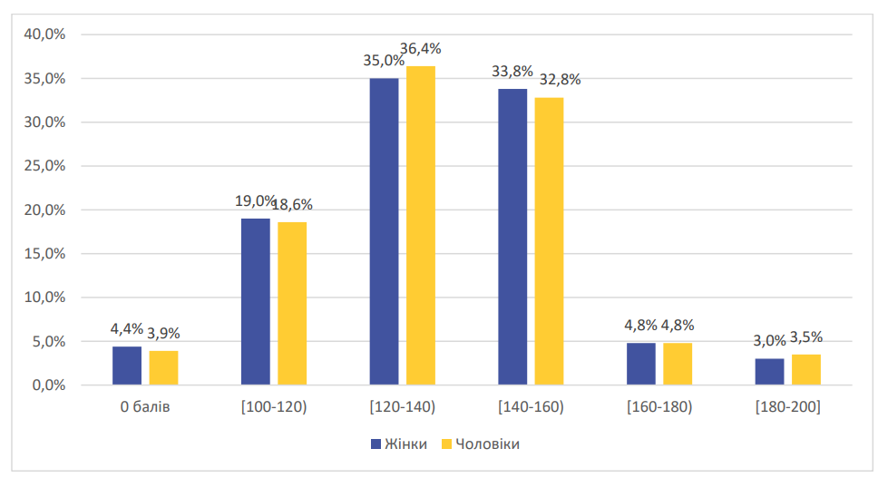
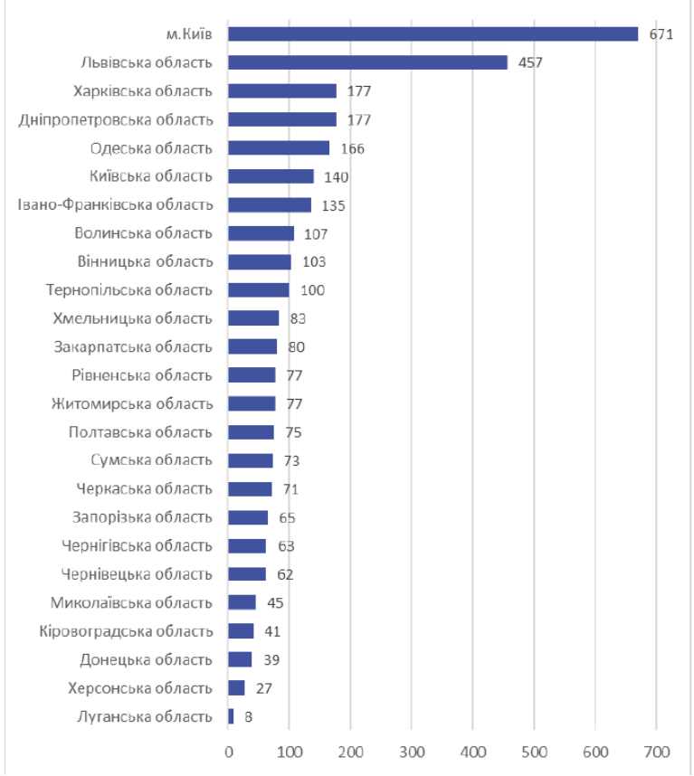
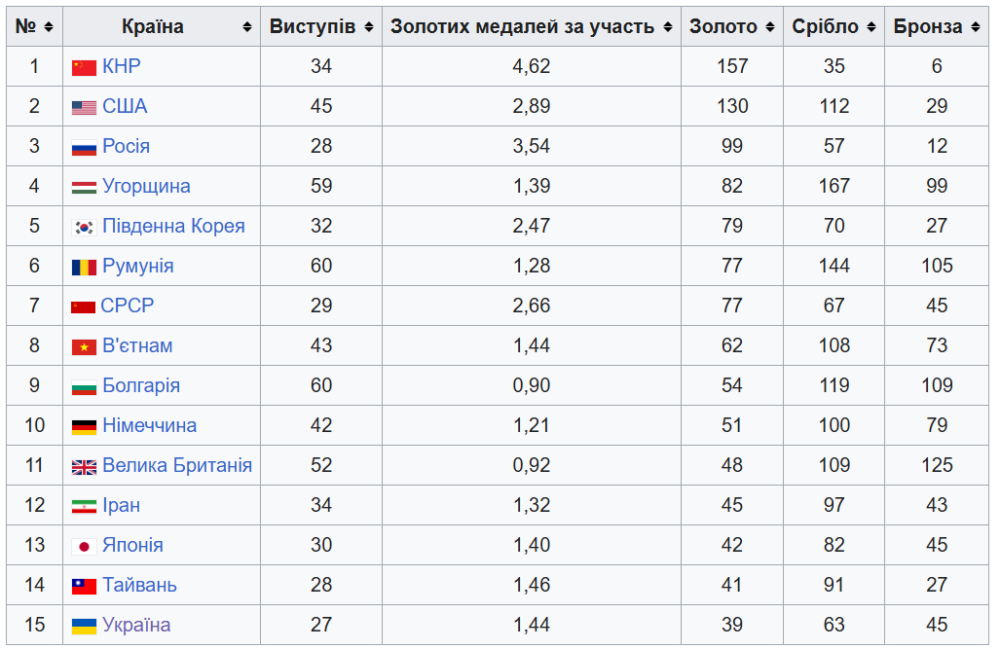

# БЛОК 6. Елементи статистики {#block6}

## Рівень 1 — легкі завдання

На діаграмі — розподіл результатів субтесту з математики НМТ 2023 за статтю.

{width=90%}

- Який відсоток чоловіків склав НМТ на 160 балів або вище?
- Який відсоток жінок склав НМТ менше ніж на 140 балів?

&nbsp;

На діаграмі — розподіл 200-бальних учасників НМТ 2024 за регіоном.

{width=90%}

- Укажіть регіон, в якому було 65 двохсотбальників.
- Укажіть регіони, де було від 80 до 120 двохсотбальників.

&nbsp;

Міжнародна математична олімпіада (ММО). Перша — 1959 р. у Румунії. Україна бере участь з 1992 р.

{width=95%}

a) Яка країна отримала найбільше бронзових медалей?
b) Які країни отримали більше срібних, ніж золотих?
c) Яка країна отримала найменшу сумарну кількість медалей?
d) Яка країна в середньому отримувала найбільше срібних медалей за участь?

&nbsp;

Вибірка: $7, 14, 7, 19, 11, 14, 5, 8, 5, 19$. Знайдіть розмах, моду, медіану та середнє арифметичне.

&nbsp;

## Рівень 2 — середні завдання

Температура протягом 10 днів: $22, 24, 21, 23, 19, 20, 18, 25, 21, 21$.

- Мода та розмах вибірки.
- Медіана вибірки.

&nbsp;

Дані про підготовку (12 студентів): $2, 3, 1, 2, 3, 5, 3, 5, 3, 2, 4, 3$.

- Розмах, мода, медіана.
- Кругова діаграма розподілу часу.

&nbsp;

Олена купила: 2 кг мандарин по 120 грн, 3 кг бананів по 64 грн, 4 кг яблук по 40 грн, 1 кг апельсинів по 80 грн. Визначте середню ціну 1 кг фруктів.

&nbsp;

Марія розподіляє бюджет 36 000 грн:

| Категорія | Сума (грн) |
|-----------|-----------|
| Житло | 14 400 |
| Харчування | 7 200 |
| Транспорт | 1 800 |
| Розваги | 1 800 |
| Здоров'я | 3 600 |
| Освіта | 3 600 |
| Заощадження | 3 600 |

Побудуйте кругову діаграму. Обчисліть градусну міру кожного сектора.

&nbsp;

## Рівень 3 — складні завдання

Вибірка: $5, 7, 14, 14, 2, 6, 9, 5, 1$. Як зміняться медіана та середнє, якщо додати 100? Що краще описує «середнє» нової вибірки — медіана чи середнє арифметичне? Чому?

&nbsp;

Вибірка: $3,4,5,8,10,4,6,1,1,10,9,4,6,6,1,3,3,8,1,2,10,4,10,1,5$. Побудуйте стовпчикову діаграму.

&nbsp;

Дані про прочитані книги (25 студентів): $0, 1, 1, 2, 3, 2, 4, 2, 1, 0, 1, 3, 4, 5, 2, 1, 0, 2, 3, 2, 4, 1, 3, 2, 1$.

- Середня кількість книг на студента.
- Гістограма розподілу.

---

## Довідкові матеріали

### Формули скороченого множення
$$a^2 - b^2 = (a-b)(a+b), \quad (a\pm b)^2 = a^2\pm 2ab+b^2$$

### Модуль числа
$$|a|=\begin{cases}a, & a\ge 0\\ -a, & a<0\end{cases}$$

### Квадратне рівняння
$$ax^2+bx+c=0,\quad D=b^2-4ac,\quad x_{1,2}=\frac{-b\pm\sqrt{D}}{2a}$$

### Степені
$$a^{-n}=\frac{1}{a^n},\quad a^{\frac{m}{n}}=\sqrt[n]{a^m},\quad a^x\cdot a^y=a^{x+y},\quad (a^x)^y=a^{xy}$$

### Логарифми
$$\log_a(bc)=\log_a b+\log_a c,\quad \log_a\frac{b}{c}=\log_a b-\log_a c,\quad \log_a b^n=n\log_a b$$

### Прогресії
| | Загальний член | Сума перших $n$ членів |
|--|--|--|
| **Арифм.** | $a_n=a_1+(n-1)d$ | $S_n=\dfrac{a_1+a_n}{2}\cdot n$ |
| **Геом.** | $b_n=b_1\cdot q^{n-1}$ | $S_n=\dfrac{b_1(q^n-1)}{q-1}$ |

### Тригонометрія
$$\sin^2\alpha+\cos^2\alpha=1,\quad \mathrm{tg}\,\alpha=\frac{\sin\alpha}{\cos\alpha},\quad \sin 2\alpha=2\sin\alpha\cos\alpha,\quad \cos 2\alpha=\cos^2\alpha-\sin^2\alpha$$

### Координати та вектори
$$|\overrightarrow{AB}|=\sqrt{(x_2-x_1)^2+(y_2-y_1)^2+(z_2-z_1)^2},\quad \vec{a}\cdot\vec{b}=a_1b_1+a_2b_2+a_3b_3$$
$$(x-a)^2+(y-b)^2=R^2 \text{ — рівняння кола}$$
