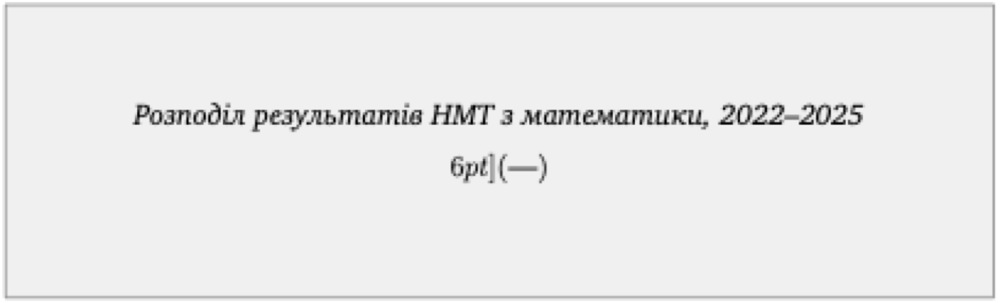
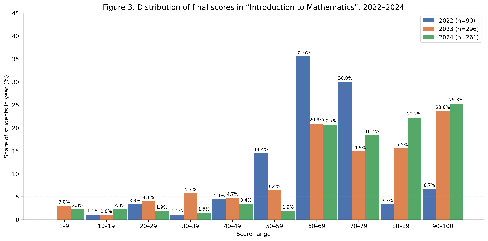
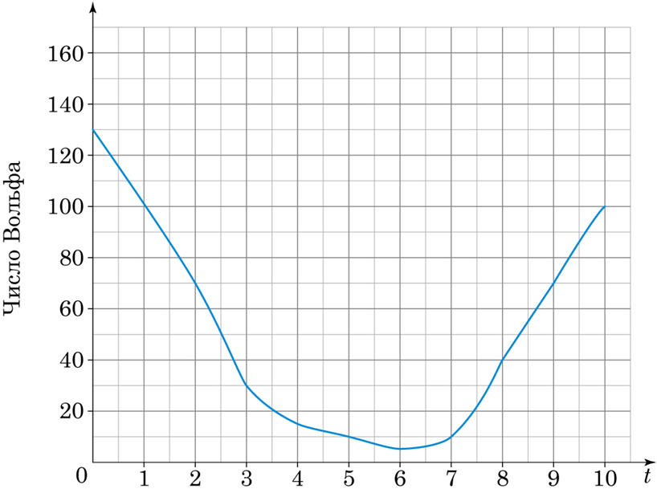
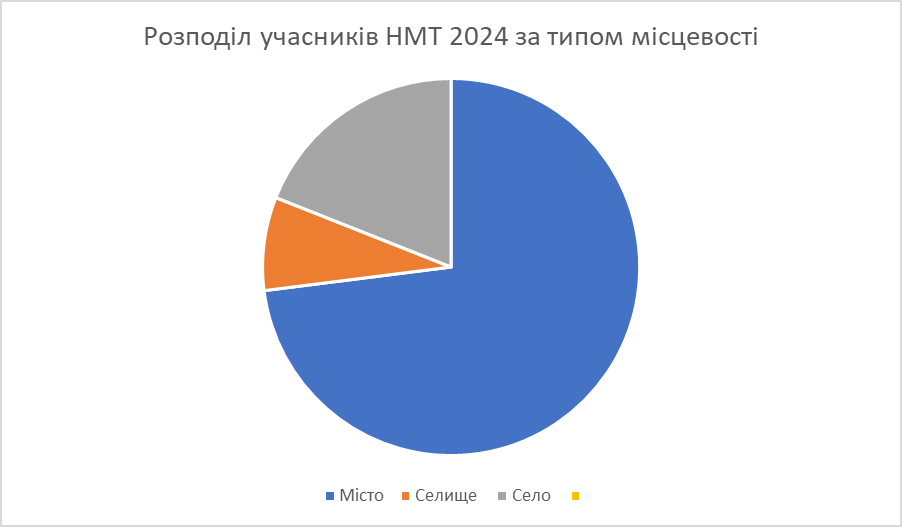

# БЛОК 6. Елементи статистики {#block6}

## Рівень 1 — легкі завдання

На діаграмі — розподіл результатів субтесту з математики НМТ 2023 за статтю.

{width=90%}

- Який відсоток чоловіків склав НМТ на 160 балів або вище?
- Який відсоток жінок склав НМТ менше ніж на 140 балів?

&nbsp;

На діаграмі — розподіл 200-бальних учасників НМТ 2024 за регіоном.

{width=90%}

- Укажіть регіон, в якому було 65 двохсотбальників.
- Укажіть регіони, де було від 80 до 120 двохсотбальників.

&nbsp;

Міжнародна математична олімпіада (ММО). Перша — 1959 р. у Румунії. Україна бере участь з 1992 р.

{width=95%}

a) Яка країна отримала найбільше бронзових медалей?
b) Які країни отримали більше срібних, ніж золотих?
c) Яка країна отримала найменшу сумарну кількість медалей?
d) Яка країна в середньому отримувала найбільше срібних медалей за участь?

&nbsp;

Вибірка: $7, 14, 7, 19, 11, 14, 5, 8, 5, 19$. Знайдіть розмах, моду, медіану та середнє арифметичне.

&nbsp;

## Рівень 2 — середні завдання

На діаграмі зображено розподіл результатів НМТ з математики всіх учасників у 2022–2025 роках (дані для візуалізації взято із сайту УЦОЯО).

{width=95%}

- У якому році був найбільший відсоток учасників, які не склали НМТ з математики?
- У якому році був найменший відсоток учасників, які склали НМТ з математики на 160 балів або більше? Який це відсоток?
- У якому році був найбільший відсоток учасників, які склали НМТ з математики менш ніж на 140 балів? Який це відсоток?
- Укажіть усі роки, у яких не менше ніж половина учасників отримали результат не нижче 100 балів, але нижче 140 балів. Поясніть.

&nbsp;

На діаграмі подано розподіл результатів курсу «Вступ до математики» за 2022–2024 роки.

{width=95%}

- а) У якому році відсоток учасників, які не склали курс (менше ніж 60 балів), був найбільшим? Який це відсоток?
- б) Скільки студентів склали курс не менше ніж на 80 балів у 2024 році?
- в) Скільки студентів не склали курс у 2024 році?

&nbsp;

На рисунку відображено зміну сонячної активності, яку характеризують числом Вольфа (середньорічна кількість сонячних плям) за останні 10 років. На горизонтальній осі змінна $t$ набуває значень від 0 (2014 рік — початок 11-річного циклу) до 10 (2024 рік).

{width=60%}

- У якому році кількість сонячних плям була найменшою?
- Яким було значення числа Вольфа у 2023 році?
- Сонячна активність вважається високою, якщо число Вольфа перевищує 60. За даними діаграми, протягом скількох років спостерігалася висока сонячна активність?
- Якщо вважати цикл сонячної активності рівним 11 рокам, то якому проміжку може належати число Вольфа у 2025 році? Відповідь обґрунтуйте. **А)** $[0;20]$ **Б)** $[20;40]$ **В)** $[60;80]$ **Г)** $[100;150]$ **Д)** $[200;300]$

&nbsp;

Температура протягом 10 днів: $22, 24, 21, 23, 19, 20, 18, 25, 21, 21$.

- Мода та розмах вибірки.
- Медіана вибірки.

&nbsp;

Дані про підготовку (12 студентів): $2, 3, 1, 2, 3, 5, 3, 5, 3, 2, 4, 3$.

- Розмах, мода, медіана.
- Кругова діаграма розподілу часу.

&nbsp;

Олена купила: 2 кг мандарин по 120 грн, 3 кг бананів по 64 грн, 4 кг яблук по 40 грн, 1 кг апельсинів по 80 грн. Визначте середню ціну 1 кг фруктів.

&nbsp;

Марія розподіляє бюджет 36 000 грн:

| Категорія | Сума (грн) |
|-----------|-----------|
| Житло | 14 400 |
| Харчування | 7 200 |
| Транспорт | 1 800 |
| Розваги | 1 800 |
| Здоров'я | 3 600 |
| Освіта | 3 600 |
| Заощадження | 3 600 |

Побудуйте кругову діаграму. Обчисліть градусну міру кожного сектора.

&nbsp;

## Рівень 3 — складні завдання

Подано результати Тесту 2 з курсу «Вступ до математики» (у балах, округлених до одиниць) однієї з груп студентів: $10, 12, 6, 8, 7, 8, 12, 7, 8, 7, 7, 11, 10, 12, 11, 10, 9, 9, 5, 7, 9, 11, 5, 6, 10, 6$.

- Побудуйте стовпчикову діаграму розподілу балів цієї групи.
- Обчисліть розмах, моду, медіану та середнє арифметичне.

&nbsp;

У торговому центрі протягом дня щогодини фіксували кількість людей у черзі до каси: $4, 7, 7, 9, 4, 6, 9, 7, 6, 4, 7, 9, 6, 4, 7, 9, 6, 4$.

- Побудуйте частотну таблицю.
- Побудуйте кругову діаграму розподілу та вкажіть градусну міру кожного сектора.
- Обчисліть розмах, моду, медіану та середнє арифметичне.

&nbsp;

У таблиці частот подано елементи варіаційного ряду $x_i$ та їхні частоти $n_i$. Визначте об'єм вибірки, розмах, моду, медіану та середнє арифметичне. Побудуйте за даними таблиці стовпчасту діаграму.

| $x_i$ | $-5$ | $-3$ | $0$ | $1$ | $2$ | $4$ | $6$ |
|-------|------|------|-----|-----|-----|-----|-----|
| $n_i$ | 2    | 4    | 3   | 1   | 4   | 5   | 1   |

&nbsp;

На круговій діаграмі показано (округлено) розподіл випускників 2024 року, що складали НМТ, за типом місцевості в Україні, де вони здобували середню освіту. Відомо, що $70\%$ учасників здобували освіту у містах, а $19\%$ — у селах. Скільки було учасників НМТ-2024, якщо здобувачів освіти у селах було на $17\,600$ більше, ніж у селищах?

{width=60%}

&nbsp;

Вибірка: $5, 7, 14, 14, 2, 6, 9, 5, 1$. Як зміняться медіана та середнє, якщо додати 100? Що краще описує «середнє» нової вибірки — медіана чи середнє арифметичне? Чому?

&nbsp;

Вибірка: $3,4,5,8,10,4,6,1,1,10,9,4,6,6,1,3,3,8,1,2,10,4,10,1,5$. Побудуйте стовпчикову діаграму.

&nbsp;

Дані про прочитані книги (25 студентів): $0, 1, 1, 2, 3, 2, 4, 2, 1, 0, 1, 3, 4, 5, 2, 1, 0, 2, 3, 2, 4, 1, 3, 2, 1$.

- Середня кількість книг на студента.
- Гістограма розподілу.
