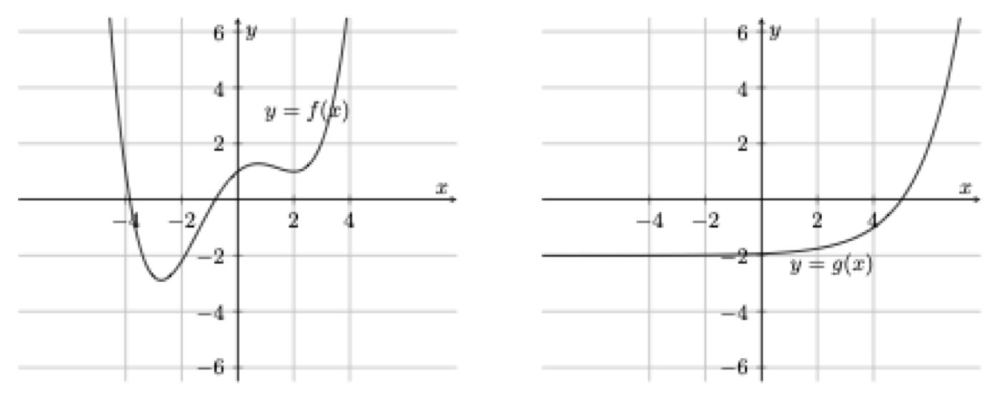
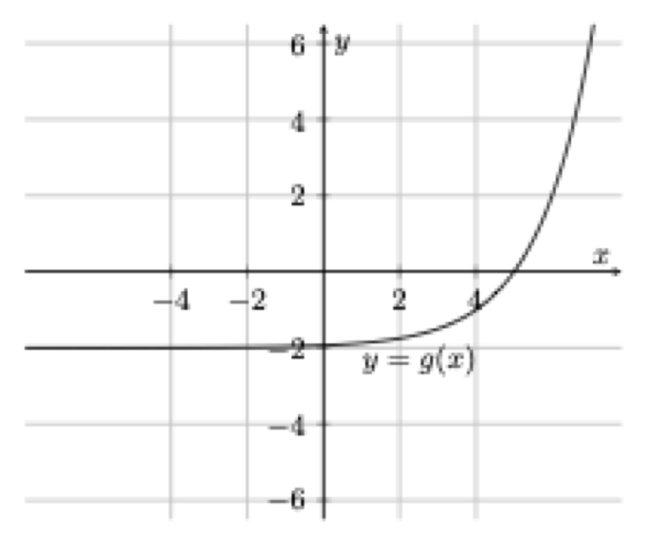

# БЛОК 3. Функції та їх застосування {#block3}

## Рівень 1 — легкі завдання

Які з наведених рівнянь а)–г) задають функцію? Для кожної функції визначте її вид (лінійна, квадратична, степенева, дробово-раціональна, логарифмічна, показникова чи тригонометрична):

- а) $y=e^x-5$
- б) $y-5x=2$
- в) $x^3=y+6$
- г) $y^2=5x^3+3$

&nbsp;

Визначте, чи є залежність, задана таблицею, функціональною. Відповідь обґрунтуйте.

| $x$ | $f(x)$ |
|-----|--------|
| 1   | 10     |
| -1  | 10     |
| 2   | 5      |
| 5   | 1      |
| -1  | 10     |
| -5  | -2     |
| -2  | 1      |

&nbsp;

На якому з рисунків зображено графік функції? Відповідь обґрунтуйте. *(Горизонтальна пряма; дві гілки параболи; ламана зі стрибком; коло)*

&nbsp;

Визначте, які з поданих функцій є парними, непарними або ні парними, ні непарними:

- $y=x|x|+x^2$
- $y=x^2+e^{|x|}$
- $y=\sin x\cos x$

&nbsp;

Обчисліть $5f(-4)+2f(4)$, якщо $f(4)=-3$ і:

- $f(x)$ — парна функція
- $f(x)$ — непарна функція

&nbsp;

## Рівень 2 — середні завдання

Знайдіть область значень функції $f(x)=-2x^2+x+1$.

&nbsp;

Побудуйте графік функції $f(x)=\log_{\sqrt{2}}(3\cdot4^{x-1})$.

&nbsp;

Нехай $f(x)=x^2+1$ та $g(x)=3x+1$. Побудуйте графік функції $(f\circ g)(x)$.

&nbsp;

Функція $y=g(x)$ визначена на проміжку $[-3;\,5]$. Знайдіть області визначення функцій:

- а) $g(x+3)$
- б) $\dfrac{g(x)}{2}$
- в) $g\!\left(\dfrac{x}{4}\right)$
- г) $g(|x|)$

&nbsp;

Побудуйте графік функції:
$$f(x)=\begin{cases}-1, & x<0\\ \sqrt{x}, & 0\le x<4\\ 6-x, & x\ge 4\end{cases}$$

&nbsp;

Побудуйте графік функції $f(x)=2\cos(\pi x)-1$. Визначте її головний період та встановіть, чи є функція парною, непарною або ні парною, ні непарною. Відповідь обґрунтуйте.

&nbsp;

Знайдіть область визначення функції $y=\log_{2}(4-x)+\sqrt{x^2-4}$.

&nbsp;

Знайдіть проміжки зростання та спадання для функції $y=3x^2-12x+18$.

&nbsp;

Знайдіть область значень функції $y=\dfrac{x}{x-3}$.

&nbsp;

Знайдіть область визначення: $f(x)=\dfrac{1}{\sqrt[3]{x^2-1}}+\log_{3-x}(x+1)$.

&nbsp;

Знайдіть область визначення: $f(x)=\dfrac{(x^2-x)^{1/8}}{\log_{x+1}(8-x)}$.

&nbsp;

Знайдіть область значень та нулі: $f(x)=3x^2+4x-7$.

&nbsp;

Побудуйте графік $f(x)=\dfrac{x^2+x}{x+1}+2$. Вкажіть область значень та нулі.

&nbsp;

Побудуйте графік функції:
$$y=\begin{cases} 5, & x\le -5 \\ -2x-5, & -5<x\le 0 \\ x^2-5, & x>0 \end{cases}$$

&nbsp;

Побудуйте графік:
$$f(x)=\begin{cases}-5-x, & x\le -3\\-2, & -3<x<0\\2x^2-1, & x\ge 0\end{cases}$$

&nbsp;

Побудуйте графік:
$$f(x)=\begin{cases}3+x, & x\le -1\\3-x^2, & x>0\end{cases}$$

&nbsp;

Задано функцію:
$$f(x)=\begin{cases}2^x, & x<0\\ 3, & 0\le x<2\\ 7-x^2, & x\ge 2\end{cases}$$

- Побудуйте графік.
- Проміжки зростання і спадання.
- Область значень.

&nbsp;

Функції $f$ та $g$ є монотонними. Відомо: $f(2)=3$, $f(3)=-2$, $g(-2)=2$, $g(3)=3$. Знайдіть:

- $g(f(3))$
- $f(g(-2))$
- $g^{-1}(3)+f^{-1}(3)$

&nbsp;

Схематично побудуйте: $a(x)=\dfrac{1}{x^4}$, $b(x)=x^{1/4}$, $c(x)=x^4$.

&nbsp;

Схематично побудуйте графіки:

- $f(x)=\dfrac{3x-1}{x}$
- $f(x)=\sqrt{|x|-4}$
- $f(x)=2\cos 3x$

&nbsp;

## Рівень 3 — складні завдання

Знайдіть функцію $t=f(y)$, для якої виконуються рівності $x=2+\log_2(2-t)$, $y=2^x+1$. Побудуйте графік цієї функції.

&nbsp;

Знайдіть область визначення функції:
$$f(x)=\begin{cases}\sqrt[4]{4-\dfrac{1}{x}}, & x>0\\[2mm] \log_{x+2}(e+1), & x\le0\end{cases}$$

&nbsp;

Знайдіть область значень функції:
$$f(x)=\begin{cases}\log_5(1+4x-x^2), & x>1\\ 5^{-x}, & x\le1\end{cases}$$

&nbsp;

Задано графіки функцій $y=f(x)$ та $y=g(x)$ (див. рисунок).

{width=80%}

Обчисліть (з наведенням проміжних кроків): $f(2)$, $g^{-1}(-1)$, $(f\circ g)(5)$, $(g^{-1}\circ g^{-1})(2)$. Розв'яжіть рівняння $f(x)=1$ та $g^{-1}(x)=6$.

&nbsp;

Нехай $f(x)=2^{x-2}+2$ та $g(x)=3\cdot2^x$. Побудуйте графік функції $y=f^{-1}(x)$. Знайдіть рівняння функції $h(x)=(f^{-1}\circ g)(x)$ та її область визначення.

&nbsp;

Задано функцію $y=f(x)$, область визначення якої $D(f)=[-2;\,4]$, а область значень $E(f)=[1;\,5]$. Визначте область визначення та область значень функцій $g(x)=-3f(-3x)$, $h(x)=f(3-x)-3$, $k(x)=3-f(3|x|+1)$. Відповідь обґрунтуйте.

&nbsp;

Задано функцію $f(x)=(x-3)^{-3}-3$. Побудуйте в одній системі координат графіки функцій $f(x)$ та $f^{-1}(x)$. Доведіть, що якщо $f(x)=x$, то $f^{-1}(x)=x$.

&nbsp;

У системі координат зображено графік функції вигляду $g(x)=Ae^{kx}+B$ (див. рисунок). Знайдіть невідомі константи $A$, $B$ та $k$ і відтворіть рівняння функції. Відповідь обґрунтуйте.

{width=60%}

&nbsp;

Нехай $f(x)=-1+2^{3+\log_4(x+1)}$. Обчисліть $f(3)$, $(f\circ f)(3)$, $(f\circ f^{-1})(1)$, $f^{-1}(7)$.

&nbsp;

Побудуйте схематично та покроково графік функції $k(x)=(4|x|-1)^4+4$.

&nbsp;

Опишіть словами перетворення графіка $y=f(x)$ для побудови:

- $g(x)=-2f(-2x-2)$
- $h(x)=\left|3-f\!\left(\dfrac{1}{3}x-1\right)\right|$

&nbsp;

Відомо, що $y=f(x)$ — лінійна функція. Графіку $y=f(x)$ належить точка $A(1;\,4)$, а графіку оберненої функції $y=f^{-1}(x)$ — точка $B(2;\,5)$. Знайдіть рівняння функції $y=f^{-1}(x)$.

&nbsp;

Знайдіть рівняння функції, оберненої до $f(x)=\left(2\cdot3^{2\log_4(3x+1)-1}-5\right)^7-10$. Укажіть область визначення та область значень прямої та оберненої функцій.

&nbsp;

Функція $y=h(x)$ — лінійна та монотонно зростаюча. Знайдіть рівняння цієї функції, якщо $h(h(x))=4x+3$.

&nbsp;

Функція $f(x)$ неперервна і зростає на проміжку $[-2;\,10]$, $f(-2)=4{,}3$, $f(10)=12$. Визначте суму всіх цілих значень $a$, для яких рівняння $f(x)=a$ має розв'язок. Відповідь обґрунтуйте.

&nbsp;

Розв'яжіть рівняння $4x^2+4x+8=7-|2x+1|$. Відповідь обґрунтуйте.

&nbsp;

Для функції $f(x)=\log_{0{,}2}(x+4)$:

- побудуйте обернену функцію $f^{-1}(x)$;
- розв'яжіть рівняння $f^{-1}(x)=21$.

&nbsp;

Скільки розв'язків має рівняння $\log_{2}x=\dfrac{1}{x^2}$? Відповідь обґрунтуйте.

&nbsp;

Скільки розв'язків має система?
$$\begin{cases}0{,}2^x-y=3\\ y+x^3=2\end{cases}$$
Відповідь обґрунтуйте.

&nbsp;

Побудуйте графік: $f(x)=|2^{|x|}-3|$.

&nbsp;

Побудуйте графік: $f(x)=|x^2-|x||$.

&nbsp;

Опишіть перетворення $y=f(x)$ для:

- $g(x)=\tfrac{2}{3}f(x+2)-3$
- $h(x)=f(3-x)+3$
- $k(x)=\tfrac{f(3x+6)}{2}$

&nbsp;

Опишіть перетворення $y=f(x)$ для:

- $g(x)=\tfrac{1}{3}f(3x+1)-3$
- $h(x)=3-f(3-x)$

&nbsp;

Опишіть перетворення графіка $y=f(x)$ для побудови:

- $y=3f(x-2)+4$
- $y=f(3x+2)$
- $y=|f(-x)|$

&nbsp;

$d(x)=3^{x-1}+2$, $b(x)=\sqrt{2-3x}$. Знайдіть $(d\circ b)(x)$, $(b\circ d)(x)$, $d^{-1}(x)$, $b^{-1}(x)$.

&nbsp;

$a(x)=3+2\log_2(x-3)$, $b(x)=(x-3)^3+2$. Знайдіть $(a\circ b)(x)$, $(b\circ a)(x)$, $a^{-1}(x)$, $b^{-1}(x)$.

&nbsp;

Подайте $h(x)=\dfrac{\sqrt{3x^4-6}}{x^4+x^2+1}$ як композицію двох функцій.

&nbsp;

Для $f(x)=2x^2-5$ побудуйте:

- Обернену функцію $f^{-1}(x)$ на $(-\infty;\,0]$.
- Обчисліть $f^{-1}(f^{-1}(-3))$.

&nbsp;

## Рівень 4 — бонус/найвищий рівень

Запишіть рівняння парної функції, графік якої проходить через $(1;\,3)$ і має горизонтальну асимптоту $y=2$.

&nbsp;

Запишіть рівняння функції, графік якої проходить через $(1;\,3)$, має горизонтальну асимптоту $y=2$ та вертикальну $x=-1$.
